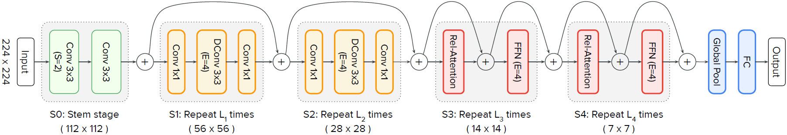

# Overview

## 1. Backbone/Classification
| model   | method                      | arch               | read       | github                                                       | special operators                                            | publication  |
| ------- | --------------------------- | ------------------ | ---------- | ------------------------------------------------------------ | ------------------------------------------------------------ | ------------ |
| ViT     | Supervised pretraining      | transformer        | yes        | https://github.com/lukemelas/PyTorch-Pretrained-ViT          | layernorm, transpose, matmul, softmax, gelu, slice, select, div, @ | ICLR 2021    |
| TNT     | Supervised pretraining      | transformer        | yes        | https://github.com/huawei-noah/CV-Backbones/tree/master/tnt_pytorch | same as ViT, nn.Unfold, reshape, permute, mul                | NeurIPS 2021 |
| Swin    | Supervised pretraining      | transformer        |            |                                                              |                                                              | ICCV 2021    |
| CoAtNet | Supervised pretraining      | conv + transformer | no weights | https://github.com/chinhsuanwu/coatnet-pytorch               | same as TNT, sigmoid, chunk, repeat, gather                  | 2021         |
| DeiT    | Supervised pretraining      | transformer        | yes        | https://github.com/facebookresearch/deit                     | same as ViT, torch.unbind                                    | 2021         |
| PVT     |                             |                    |            |                                                              |                                                              |              |
| VOLO    |                             |                    |            |                                                              |                                                              |              |
| iGPT    | Self-supervised pretraining |                    |            |                                                              |                                                              | ICML 2020    |
| MoCo v3 | Self-supervised pretraining |                    |            |                                                              |                                                              | ICCV 2021    |
|         |                             |                    |            |                                                              |                                                              |              |
|         |                             |                    |            |                                                              |                                                              |              |


Fig. 1: A taxonomy of backbone using convolution and attention.


TABLE 1: ImageNet result comparison of representative CNN and vision transformer models. The throughput is measured on NVIDIA V100 GPU and Pytorch, with 224 * 224 input size. Pure transformer means only using a few convolutions in the stem stage. CNN + Transformer means using convolutions in the intermediate layers. 

| Model                 | Params(M) | FLOPs(B) | Throughput(image/s) | Top-1(%) |
| --------------------- | --------- | -------- | ------------------- | -------- |
| **CNN**               |           |          |                     |          |
| ResNet-50             | 25.6      | 4.1      | 1226                | 79.1     |
| ResNet-101            | 44.7      | 7.9      | 753                 | 79.9     |
| ResNet-152            | 60.2      | 11.5     | 526                 | 80.8     |
| EfficientNet-B0       | 5.3       | 0.39     | 2694                | 77.1     |
| EfficientNet-B1       | 7.8       | 0.70     | 1662                | 79.1     |
| EfficientNet-B2       | 9.2       | 1.0      | 1255                | 80.1     |
| EfficientNet-B3       | 12        | 1.8      | 732                 | 81.6     |
| EfficientNet-B4       | 19        | 4.2      | 349                 | 82.9     |
| **Pure Transformer**  |           |          |                     |          |
| DeiT-Ti               | 5         | 1.3      | 2536                | 72.2     |
| DeiT-S                | 22        | 4.6      | 940                 | 79.8     |
| DeiT-B                | 86        | 17.6     | 292                 | 81.8     |
| T2T-ViT-14            | 21.5      | 5.2      | 764                 | 81.5     |
| T2T-ViT-19            | 39.2      | 8.9      | 464                 | 81.9     |
| T2T-ViT-24            | 64.1      | 14.1     | 312                 | 82.3     |
| PVT-Small             | 24.5      | 3.8      | 820                 | 79.8     |
| PVT-Medium            | 44.2      | 6.7      | 526                 | 81.2     |
| PVT-Large             | 61.4      | 9.8      | 367                 | 81.7     |
| TNT-S                 | 23.8      | 5.2      | 428                 | 81.5     |
| TNT-B                 | 65.6      | 14.1     | 246                 | 82.9     |
| CPVT-S                | 23        | 4.6      | 930                 | 80.5     |
| CPVT-B                | 88        | 17.6     | 285                 | 82.3     |
| Swin-T                | 29        | 4.5      | 755                 | 81.3     |
| Swin-S                | 50        | 8.7      | 437                 | 83.0     |
| Swin-B                | 88        | 15.4     | 278                 | 83.3     |
| **CNN + Transformer** |           |          |                     |          |
| Twins-SVT-S           | 24        | 2.9      | 1059                | 81.7     |
| Twins-SVT-B           | 56        | 8.6      | 469                 | 83.2     |
| Twins-SVT-L           | 99.2      | 15.1     | 288                 | 83.7     |
| Shuffle-T             | 29        | 4.6      | 791                 | 82.5     |
| Shuffle-S             | 50        | 8.9      | 450                 | 83.5     |
| Shuffle-B             | 88        | 15.6     | 279                 | 84.0     |
| CMT-S                 | 25.1      | 4.0      | 563                 | 83.5     |
| CMT-B                 | 45.7      | 9.3      | 285                 | 84.5     |
| VOLO-D1               | 27        | 6.8      | 481                 | 84.2     |
| VOLO-D2               | 59        | 14.1     | 244                 | 85.2     |
| VOLO-D3               | 86        | 20.6     | 168                 | 85.4     |
| VOLO-D4               | 193       | 43.8     | 100                 | 85.7     |
| VOLO-D5               | 296       | 69.0     | 64                  | 86.1     |


## 1.1 ViT


## 1.2 TNT


```python
outer_tokens[:,1:] = outer_tokens[:,1:] + self.proj_norm2(self.proj(self.proj_norm1(inner_tokens.reshape(B, N-1, -1)))) 
```

上述代码实现inner T-block与outer T-block相加，注意outer T-block是带片选，即outer_tokens[:, 0]保持不变。

**Inner Transformer Block**

TNT的Transformer Block与ViT的Encoder结构几乎相同，但在代码写法上不一致，导致生成的图不同。巧妙的地方在于，通过合并Q和K的权重矩阵，一个nn.liner算子可同时生成Q和K，之后片选出Q和K即可。


## 1.3 Swin 


## 1.4 CoAtNet



模块的结构上，S1和S2模块含卷积+SE模块；S3和S4含使用相对位置自注意力的transformer。

CoAtNet内，模块S1, S2, S3, S4分别会重复L1, L2, L3, L4次。模块S1重复堆叠时，只有第一次含pool作下采样，其余(L1-1)次没有pool；S2，S3，S4等也是如此。

**SE模块**


**相对位置自注意力**
$$
RelativeAttention = softmax(\frac{QK^{T}+S^{rel}}{\sqrt{D_h}})*V
$$


## 1.5 DeiT

对ViT进行知识蒸馏得到，结构几乎与ViT相同，除了网络最末端的分类头。


多注意力头写法不一样，结构一样。并且多了个torch.unbind算子，用于切片。


## 2. High/Mid-level vision

## 2.1 Object detection
|model|method|read|github|special operators|publication|
|--|--|--|--|--|--|
| DETR | | yes | https://github.com/facebookresearch/detr |  | 2020 |
| Deformable DETR | | | https://github.com/fundamentalvision/Deformable-DETR | | |
| | | | | | |

### 2.1.1 DETR

(1) DETR整体结构


(2) DETR的transformer

spatial positional encoding即位置编码，采用正余弦编码，与NLP transformer几乎一致。

生成spatial positional encoding的代码稍微复杂，但其具体值只与输入图片的尺寸、transformer块的维度hidden_dim有关，即与图片的内容无关。可以提前生成并保存下来。


(3) Encoder

若输入图像没有padding，则mask是一个零矩阵；若输入图像有padding，则mask生成示意图如下：


mask=None时的encoder （修改了源码，使mask不为零矩阵，而是None）


mask!=None时的encoder


(4) Decoder

输入注意力头的q, k, v 的产生不同于encoder。the last encoder指最后一个encoder的输出。object queries由.nn.Embedding创建，是可训练的权重。同样有mask。


## 2.2 Segmentation

|model|method|metric|flops|publication|
|--|--|--|--|--|
| | | | | |
| | | | | |
| | | | | |

## 2.3 Pose Estimation
|model|method|metric|flops|publication|
|--|--|--|--|--|
| | | | | |
| | | | | |
| | | | | |
||||||


## 3. Low-level vision

### Image generation
|model|method|metric|flops|publication|
|--|--|--|--|--|
| | | | | |
| | | | | |
| | | | | |

### Image enhancement
|model|method|metric|flops|publication|
|--|--|--|--|--|
| | | | | |
| | | | | |
| | | | | |
||||||


## 4. Video processing

|model|method|metric|flops|publication|
|--|--|--|--|--|
| | | | | |
| | | | | |
| | | | | |
||||||


## 5. Multimodality

|model|method|metric|flops|publication|
|--|--|--|--|--|
| | | | | |
| | | | | |
| | | | | |
||||||


## 6. Efficient transformer

|model|method|metric|flops|publication|
|--|--|--|--|--|
| | | | | |
| | | | | |
| | | | | |
